# FAZ 2 - Projeye Özel Malzeme Sistemi Analiz Raporu

**Tarih:** 2026-09-21  
**Hazırlayan:** GitHub Copilot  
**Durum:** Analiz Aşaması - Henüz Kod Değiştirilmedi

---

## İÇİNDEKİLER

1. [Mevcut Mimari Özeti](#1-mevcut-mimari-özeti)
2. [İlişki Şeması](#2-ilişki-şeması)
3. [Soru Cevapları (A-J)](#3-soru-cevapları-a-j)
4. [Önerilen Model Yapısı](#4-önerilen-model-yapısı)
5. [Eksik Modeller](#5-eksik-modeller)
6. [Değişmesi Gereken Backend Dosyaları](#6-değişmesi-gereken-backend-dosyaları)
7. [Değişmesi Gereken Frontend Dosyaları](#7-değişmesi-gereken-frontend-dosyaları)
8. [API Tasarımı](#8-api-tasarımı)
9. [Fiyat Fallback Mantığı](#9-fiyat-fallback-mantığı)
10. [Snapshot Stratejisi](#10-snapshot-stratejisi)
11. [Riskler](#11-riskler)
12. [Uygulama Sırası](#12-uygulama-sırası)

---

## 1. MEVCUT MİMARİ ÖZETİ

### 1.1 Temel Modeller (construction/models.py)

| Model | Açıklama | Tenant İzolasyonu |
|-------|----------|-------------------|
| **PozGrubu** | Poz grupları (hiyerarşik) | ✅ TenantAwareModel |
| **Poz** | Poz kartı (ÇŞİDB/firma özel) | ✅ TenantAwareModel |
| **Malzeme** | Malzeme kartı (TS/TS EN referanslı) | ✅ TenantAwareModel |
| **PozMalzemeIliskisi** | Poz-Malzeme many-to-many (through) | ✅ TenantAwareModel |
| **PozFiyat** | Poz birim fiyatı (yıl/dönem bazlı) | ✅ TenantAwareModel |
| **ProjePozFiyat** | Projeye özel poz fiyatı (override) | ✅ TenantAwareModel |
| **YfkPozVersiyon** | YFK poz tanımı (versiyonlu) | ✅ TenantAwareModel |
| **YfkFiyat** | YFK poz birim fiyatı | ✅ TenantAwareModel |
| **YfkRayic** | YFK rayıç (katsayı) | ✅ TenantAwareModel |
| **YfkAnaliz** | YFK poz analizi detayları | ✅ TenantAwareModel |
| **Proje** | İnşaat projesi | ✅ TenantAwareModel |
| **Mahal** | Proje içindeki mahal/oda | ✅ TenantAwareModel |
| **YaklasikMaliyet** | Proje için poz bazlı yaklaşık maliyet | ✅ TenantAwareModel |
| **YaklasikMaliyetSatiri** | Yaklaşık maliyet poz satırı (snapshot) | ✅ TenantAwareModel |
| **PozPlan** | Poz maliyet planı (planlanan/gerçekleşen) | ✅ TenantAwareModel |
| **Hakedis** | Dönemsel hakediş | ✅ TenantAwareModel |
| **HakedisSatiri** | Hakediş satırı (poz + miktar + snapshot) | ✅ TenantAwareModel |
| **Tedarikci** | Tedarikçi firma kartı | ✅ TenantAwareModel |
| **MalzemeTedarikciIliskisi** | Malzeme-tedarikçi sipariş takibi | ✅ TenantAwareModel |
| **TedarikciTeklifi** | Proje/malzeme için teklif karşılaştırması | ✅ TenantAwareModel |

### 1.2 Fiyatlandırma Servisleri (construction/services.py)

- **poz_birim_fiyati(poz, yil)**: Sadece PozFiyat'tan genel fiyat getirir
- **poz_etkin_fiyati(proje, poz, yil)**: Fallback zinciri ile etkin fiyatı çözer
  1. ProjePozFiyat (proje özel)
  2. PozFiyat (genel tenant fiyatı)
  3. YfkFiyat (YFK referans)

### 1.3 Snapshot Mekanizması

| Model | Snapshot Alanı | Ne Zaman Alınır |
|-------|----------------|-----------------|
| **YaklasikMaliyetSatiri** | `birim_fiyat_snapshot` | Satır oluşturulurken (PozFiyat'tan) |
| **PozPlan** | `birim_fiyat_snapshot` | Plan oluşturulurken (poz_birim_fiyati servisinden) |
| **HakedisSatiri** | `birim_fiyat` | Hakediş satırı oluşturulurken (PozPlan'dan) |

**KRİTİK KURAL:** PozPlan, YaklasikMaliyetSatiri, HakedisSatiri snapshot kayıtlarının geçmiş fiyatları ASLA değiştirilmez.

---

## 2. İLİŞKİ ŞEMASI

```mermaid
erDiagram
    TENANT ||--o{ PROJE : "sahip"
    TENANT ||--o{ POZ : "tanımlar"
    TENANT ||--o{ MALZEME : "tanımlar"
    TENANT ||--o{ POZ_FIYAT : "fiyatlandırır"
    TENANT ||--o{ PROJE_POZ_FIYAT : "override eder"
    TENANT ||--o{ YFK_POZ : "referans"
    TENANT ||--o{ YFK_FIYAT : "referans fiyat"
    TENANT ||--o{ YFK_RAYIC : "katsayı"
    TENANT ||--o{ YFK_ANALIZ : "analiz"
    TENANT ||--o{ TEDARIKCI : "kayıtlı"
    TENANT ||--o{ CARI : "cari kartı"
    
    PROJE ||--o{ MAHAL : "içerir"
    PROJE ||--o{ POZ_PLAN : "planlar"
    PROJE ||--o{ YAKLASIK_MALIYET : "maliyet çalışması"
    PROJE ||--o{ HAKEDIS : "hakediş"
    PROJE ||--o{ PROJE_POZ_FIYAT : "özel fiyat"
    PROJE ||--o{ TEDARIKCI_TEKLIFI : "teklif alır"
    PROJE ||--o{ NAKLIYE_MESAFE : "mesafe"
    
    POZ ||--o{ POZ_MALZEME_ILISKISI : "içerir"
    POZ ||--o{ POZ_FIYAT : "fiyatı var"
    POZ ||--o{ PROJE_POZ_FIYAT : "proje fiyatı"
    POZ ||--o{ POZ_ANALIZ : "analizi var"
    POZ ||--o{ YAKLASIK_MALIYET_SATIRI : "maliyet satırı"
    POZ ||--o{ POZ_PLAN : "planı var"
    POZ ||--o{ HAKEDIS_SATIRI : "hakediş satırı"
    POZ ||--o{ NAKLIYE_MESAFE : "mesafesi var"
    
    MALZEME ||--o{ POZ_MALZEME_ILISKISI : "kullanılır"
    MALZEME ||--o{ MALZEME_TEDARIKCI_ILISKISI : "tedarikçisi"
    MALZEME ||--o{ TEDARIKCI_TEKLIFI : "teklif alınır"
    
    YFK_POZ_VERSIYON ||--o{ YFK_FIYAT : "fiyatları"
    YFK_POZ_VERSIYON ||--o{ YFK_RAYIC : "rayıçları"
    YFK_POZ_VERSIYON ||--o{ YFK_ANALIZ : "analizleri"
    
    YAKLASIK_MALIYET ||--o{ YAKLASIK_MALIYET_SATIRI : "satırları"
    HAKEDIS ||--o{ HAKEDIS_SATIRI : "satırları"
    POZ_PLAN ||--o{ HAKEDIS_SATIRI : "kaynak (gerçekleşen metraj)"
    
    TEDARIKCI ||--o{ MALZEME_TEDARIKCI_ILISKISI : "malzemeleri"
    TEDARIKCI ||--o{ TEDARIKCI_TEKLIFI : "teklifleri"
    TEDARIKCI ||--o{ CARI : "cari kartı (tip=TEDARIKCI)"
```



---

## 3. SORU CEVAPLARI (A-J)

### A) Mevcut Malzeme modeli tam olarak nedir?

**Malzeme** (`construction/models.py` satır 77-110):
- `malzeme_kodu`: Benzersiz kod (tenant içinde unique)
- `ad`: Malzeme adı
- `birim`: Ölçü birimi (m², m³, kg, adet, lt)
- `ts_no`: TS/TS EN referans standardı
- `qr_kodu`: Otomatik üretilen opak kod (EML-...)
- `is_active`: Aktif/pasif
- TenantAwareModel'dan türetilir → multi-tenant izolasyonu var

### B) Bir malzemenin poz analiziyle ilişkisi nasıl kurulmuş?

**PozMalzemeIliskisi** (through model, satır 112-148):
- `poz` FK → Poz (related_name="malzeme_kalemleri")
- `malzeme` FK → Malzeme (related_name="poz_kalemleri")
- `miktar`: Pozun bir birimi için gereken malzeme miktarı (Decimal, > 0)
- Unique constraint: (tenant, poz, malzeme)
- Check constraint: miktar > 0

**PozAnaliz** (satır 1008-1035) - Farklı bir yapı:
- `poz` FK → Poz (related_name="analizler")
- `malzeme`: CharField (malzeme adı, FK YOK!)
- `analiz_tipi`: MALZEME/ISCIK/MAKINE/NAKLIYE/DIGER
- `miktar`, `birim_fiyat`, `tutar` (otomatik hesaplanır)
- **SORUN:** PozAnaliz'de malzeme FK yok, sadece isim string olarak tutuluyor

### C) Aynı malzeme birden fazla pozda nasıl kullanılabiliyor?

**PozMalzemeIliskisi** many-to-many through modeli sayesinde:
- Bir Malzeme → birden fazla PozMalzemeIliskisi → birden fazla Poz
- `malzeme.poz_kalemleri` related_name ile ters erişim
- Her ilişkinin kendi `miktar`ı var (poz başına miktar)

### D) Malzemenin mevcut fiyatı nereden geliyor?

**Mevcut yapıda Malzeme modelinde fiyat alanı YOK!**

Fiyat kaynakları:
1. **PozFiyat** - Poz bazlı yıl/dönem fiyatı (Poz'un fiyatı)
2. **ProjePozFiyat** - Proje özel poz fiyatı (override)
3. **YfkFiyat** - YFK referans fiyatı
4. **TedarikciTeklifi** - Tedarikçi teklif fiyatı (proje/malzeme bazlı)
5. **MalzemeTedarikciIliskisi** - Sipariş takibi, fiyat yok

**EKSİK:** Malzeme kartında doğrudan birim fiyat alanı yok. Malzeme fiyatı poz analizi üzerinden (PozAnaliz.birim_fiyat) veya tedarikçi teklifi üzerinden geliyor.

### E) Poz analizinde miktar ve birim nasıl tutuluyor?

**PozMalzemeIliskisi** (poz-malzemesi):
- `miktar`: Decimal(14,4) - poz birimi başına malzeme miktarı
- `birim`: Malzeme modelinden gelir (malzeme.birim)

**PozAnaliz** (detay analiz):
- `miktar`: Decimal(14,4)
- `birim`: CharField(20) - analiz satırının birimi
- `birim_fiyat`: Decimal(14,2)
- `tutar`: Otomatik = miktar × birim_fiyat

**YaklasikMaliyetSatiri**:
- `miktar`: Poz metrajı
- `birim_fiyat_snapshot`: Kayıt anındaki fiyat (değişmez)
- `toplam_tutar`: Otomatik hesaplanır

### F) Yaklaşık maliyet hesabı hangi model/service üzerinden yapılıyor?

**Model:** `YaklasikMaliyet` + `YaklasikMaliyetSatiri`
**Service:** `construction/services/yaklasik_maliyet.py`
- `hesapla(yaklasik_maliyet)`: Tüm satırları toplar, `toplam_tutar` günceller
- `revize(yaklasik_maliyet)`: Yeni versiyon oluşturur, satırları kopyalar (snapshot korunur)
- `mahal_listesinden_olustur()`: Mahal metrajlarından maliyet satırı üretir

**Fiyat kaynağı:** Satır oluşturulurken `PozFiyat`'tan `birim_fiyat_snapshot` alınır.

### G) Snapshot fiyat mekanizması tam olarak nerede oluşturuluyor?

| Model | Metot | Kaynak |
|-------|-------|--------|
| **YaklasikMaliyetSatiri.save()** | Otomatik (satır 1080-1095) | PozFiyat (tenant+poz+yıl, is_active=True, en son created_at) |
| **PozPlan.save()** | Otomatik (satır 1190-1198) | `poz_birim_fiyati(poz, yil)` servisi → fallback zinciri |
| **HakedisSatiri** | `hakedis_satirlari_olustur()` servisinde | PozPlan.birim_fiyat_snapshot'tan kopyalanır |

**ÖNEMLI:** PozPlan.save() içinde `poz_etkin_fiyati` KULLANILMIYOR, sadece `poz_birim_fiyati` (PozFiyat) kullanılıyor. Bu bir TUTARSIZLIK!

### H) Proje özel malzeme için mevcut yapılardan hangileri yeniden kullanılabilir?

**Yeniden Kullanılabilir:**
1. **ProjePozFiyat** pattern'i → `ProjeMalzemeFiyat` için birebir uyarlanabilir
2. **TedarikciTeklifi** - zaten proje/malzeme/tedarikci bazlı, `secildi` alanı var
3. **MalzemeTedarikciIliskisi** - malzeme-tedarikci bağlantısı var
4. **TenantAwareModel** - multi-tenant altyapı hazır
5. **Snapshot mantığı** - PozPlan/YaklasikMaliyetSatiri pattern'i aynen kullanılabilir
6. **Cari modeli** - Tedarikci aslında Cari tipinde (CariTipi.TEDARIKCI)

**Yeni Gerekli:**
1. **ProjeMalzeme** - Proje bazında malzeme override (alternatif malzeme, özel birim fiyat, tedarikçi)
2. **ProjeMalzemeFiyat** - Proje özel malzeme birim fiyatı (ProjePozFiyat'e benzer)

### I) Tedarikçi/cari sistemi mevcutsa nasıl bağlanmalı?

**Mevcut Bağlantılar:**
- `Tedarikci` modeli bağımsız (construction/models.py satır 1400+)
- `Cari` modeli (cari/models.py) - `tip` alanı: TEDARIKCI, TASERON, KIRACI, MALIK, DIGER
- `TedarikciTeklifi` - proje/malzeme/tedarikci bazlı teklif
- `MalzemeTedarikciIliskisi` - malzeme/tedarikci sipariş takibi

**Eksik Bağlantı:** Tedarikci ↔ Cari birebir eşleşme yok. Tedarikci ayrı bir model, Cari ayrı.

**Öneri:** `ProjeMalzeme` modelinde:
- `tedarikci` FK → `construction.Tedarikci` (veya `cari.Cari` tip=TEDARIKCI filtresiyle)
- `cari` FK → `cari.Cari` (muhasebe/cari hareket için)

### J) Multi-tenant izolasyonu nerede ve nasıl sağlanıyor?

**Temel Yapı:** `tenants/models.py`
- `Tenant` modeli: name, slug, limits (max_users, max_projects, max_storage_gb)
- `TenantAwareModel` abstract base: `tenant = FK(Tenant, PROTECT, related_name="+")`
- Tüm modeller `TenantAwareModel`'den türetilir

**Uygulama Katmanları:**
1. **Model:** Her sorgu `tenant_id` filtresi ile (unique constraints tenant dahil)
2. **ViewSet:** `TenantScopedViewSet` → `get_queryset()` otomatik `tenant_kapsamli_queryset` uygular
3. **Serializer:** `TenantAwareModelSerializer` → create/update'te tenant otomatik set edilir
4. **Middleware/Request:** `request.user.tenant_id` üzerinden tenant belirlenir
5. **Permission:** `IsConstructionEditor` + tenant kontrolü

---

## 4. ÖNERİLEN MODEL YAPISI

### Hedef Mimari

```
Proje
 ├── ProjePozFiyat (mevcut - poz fiyat override)
 ├── ProjeMalzemeFiyat (YENİ - malzeme fiyat override)
 └── ProjeMalzeme (YENİ - proje özel malzeme tanımı)
        └── Malzeme (global malzeme kartı)
              └── Poz Analizi (PozMalzemeIliskisi / PozAnaliz)

Poz
 └── Poz Analizi
       ├── İşçilik (PozAnaliz tip=ISCIK)
       ├── Makine (PozAnaliz tip=MAKINE)
       ├── Malzeme (PozMalzemeIliskisi + PozAnaliz tip=MALZEME)
       └── Diğer (PozAnaliz tip=NAKLIYE/DIGER)
```

### 4.1 Yeni Model: ProjeMalzeme

```python
class ProjeMalzeme(TenantAwareModel):
    """Projeye özel malzeme tanımı - global malzeme kartının proje bazlı override'ı."""
    
    proje = FK(Proje, CASCADE, related_name="proje_malzemeleri")
    malzeme = FK(Malzeme, PROTECT, related_name="proje_malzemeleri")  # Global malzeme
    
    # Override alanları (boşsa global malzemeden alınır)
    ad_override = CharField(max_length=255, blank=True)  # Proje özel adı
    birim_override = CharField(max_length=20, blank=True)  # Proje özel birimi
    ts_no_override = CharField(max_length=100, blank=True)  # Proje özel standard
    
    # Alternatif malzeme seçimi
    alternatif_malzeme = FK(Malzeme, PROTECT, null=True, blank=True, 
                            related_name="alternatif_olan_proje_malzemeleri")
    alternatif_aciklama = TextField(blank=True)  # Neden alternatif seçildi?
    
    # Tedarikçi bağlantısı
    tedarikci = FK(Tedarikci, PROTECT, null=True, blank=True, 
                   related_name="proje_malzemeleri")
    cari = FK("cari.Cari", PROTECT, null=True, blank=True,
              related_name="proje_malzemeleri", 
              limit_choices_to={"tip": CariTipi.TEDARIKCI})
    
    # Kaynak bilgisi
    kaynak = CharField(max_length=100, blank=True)  # Örn: "Proje özel teklif", "Tedarikçi X"
    kaynak_url = URLField(max_length=250, blank=True)
    
    # Aktiflik
    is_active = BooleanField(default=True)
    created_at, updated_at = DateTimeField(auto_now_add=True), DateTimeField(auto_now=True)
    
    class Meta:
        unique_together = [["tenant", "proje", "malzeme"]]
        ordering = ["proje__proje_kodu", "malzeme__malzeme_kodu"]
```

### 4.2 Yeni Model: ProjeMalzemeFiyat

```python
class ProjeMalzemeFiyat(TenantAwareModel):
    """Projeye özel malzeme birim fiyatı - ProjePozFiyat'ın malzeme karşılığı."""
    
    proje = FK(Proje, CASCADE, related_name="malzeme_fiyatlari")
    malzeme = FK(Malzeme, PROTECT, related_name="proje_fiyatlari")
    yil = PositiveSmallIntegerField()
    
    birim_fiyat = DecimalField(max_digits=14, decimal_places=2, 
                               validators=[MinValueValidator(Decimal("0.01"))])
    kaynak = CharField(max_length=100, blank=True)  # "Tedarikçi X teklifi", "Pazarlık sonucu"
    kaynak_url = URLField(max_length=250, blank=True)
    is_active = BooleanField(default=True)
    created_at, updated_at = DateTimeField(auto_now_add=True), DateTimeField(auto_now=True)
    
    class Meta:
        unique_together = [["tenant", "proje", "malzeme", "yil"]]
        ordering = ["proje__proje_kodu", "malzeme__malzeme_kodu", "-yil"]
```

---

## 5. EKSİK MODELLER

| Model | Açıklama | Öncelik |
|-------|----------|---------|
| **ProjeMalzeme** | Proje özel malzeme override, alternatif seçim, tedarikçi | 🔴 KRİTİK |
| **ProjeMalzemeFiyat** | Proje özel malzeme birim fiyatı (yıl bazlı) | 🔴 KRİTİK |
| **MalzemeFiyat** (opsiyonel) | Global malzeme bazlı fiyat (PozFiyat'a benzer) | 🟡 ORTA |
| **ProjeMalzemeAnaliz** (opsiyonel) | Proje özel poz analiz malzeme miktarı override | 🟢 DÜŞÜK |

---

## 6. DEĞİŞMESİ GEREKEN BACKEND DOSYALARI

### 6.1 Yeni Dosyalar
| Dosya | Açıklama |
|-------|----------|
| `construction/models.py` | + ProjeMalzeme, ProjeMalzemeFiyat modelleri |
| `construction/serializers.py` | + ProjeMalzemeSerializer, ProjeMalzemeFiyatSerializer |
| `construction/views.py` | + ProjeMalzemeViewSet, ProjeMalzemeFiyatViewSet |
| `construction/services/malzeme_fiyat.py` (YENİ) | Malzeme fiyat fallback servisi |
| `construction/migrations/xxxx_proje_malzeme.py` | Migration dosyası |

### 6.2 Değiştirilecek Dosyalar
| Dosya | Değişiklik |
|-------|------------|
| `construction/services.py` | `malzeme_etkin_fiyati(proje, malzeme, yil)` fonksiyonu eklenecek |
| `construction/services/yaklasik_maliyet.py` | Malzeme fiyatı için yeni fallback kullanacak |
| `construction/serializers.py` | YaklasikMaliyetSatiriSerializer - malzeme fiyatı için yeni servis |
| `construction/views.py` | PozPlanViewSet - malzeme bazlı raporlar için endpoint |
| `tenants/api.py` | TenantScopedViewSet zaten hazır, yeni ViewSet'ler bunu kullanacak |

---

## 7. DEĞİŞMESİ GEREKEN FRONTEND DOSYALARI

### 7.1 Yeni Dosyalar
| Dosya | Açıklama |
|-------|----------|
| `frontend/src/views/insaat/ProjeMalzemeView.vue` | Proje malzeme yönetimi (liste, oluştur, düzenle) |
| `frontend/src/views/insaat/ProjeMalzemeFiyatView.vue` | Proje malzeme fiyat yönetimi |
| `frontend/src/views/insaat/MalzemeFiyatKarsilastirmaView.vue` | Malzeme fiyat karşılaştırma (tedarikçi teklifi + proje fiyatı + genel) |

### 7.2 Değiştirilecek Dosyalar
| Dosya | Değişiklik |
|-------|------------|
| `frontend/src/types/insaat.ts` | + ProjeMalzeme, ProjeMalzemeFiyat interface'leri |
| `frontend/src/services/insaatApi.ts` | + projeMalzemeler, projeMalzemeFiyatlari API çağrıları |
| `frontend/src/views/insaat/YaklasikMaliyetView.vue` | Satır eklerken malzeme fiyatı fallback'i göster |
| `frontend/src/views/insaat/PozPlanlariView.vue` | Malzeme bazlı maliyet analizi sekmesi |
| `frontend/src/views/insaat/TedarikciTeklifleriView.vue` | Seçilen teklif → ProjeMalzemeFiyat'a aktar butonu |
| `frontend/src/stores/insaat.ts` | Yeni store modülleri |

---

## 8. API TASARIMI

### 8.1 ProjeMalzeme Endpoints

```
GET    /api/v1/construction/proje-malzemeler/?proje=<id>          # Liste
POST   /api/v1/construction/proje-malzemeler/                    # Oluştur
GET    /api/v1/construction/proje-malzemeler/<id>/               # Detay
PUT    /api/v1/construction/proje-malzemeler/<id>/               # Güncelle
PATCH  /api/v1/construction/proje-malzemeler/<id>/               # Kısmi güncelle
DELETE /api/v1/construction/proje-malzemeler/<id>/               # Pasif et (soft delete)

# Özel aksiyonlar
POST   /api/v1/construction/proje-malzemeler/<id>/alternatif-sec/    # Alternatif malzeme seç
POST   /api/v1/construction/proje-malzemeler/<id>/tedarikci-ata/     # Tedarikçi ata
GET    /api/v1/construction/proje-malzemeler/fiyat-karsilastirma/?proje=<id>&malzeme=<id>  # Fiyat karşılaştırma
```

### 8.2 ProjeMalzemeFiyat Endpoints

```
GET    /api/v1/construction/proje-malzeme-fiyatlari/?proje=<id>&yil=<yil>
POST   /api/v1/construction/proje-malzeme-fiyatlari/
GET    /api/v1/construction/proje-malzeme-fiyatlari/<id>/
PUT    /api/v1/construction/proje-malzeme-fiyatlari/<id>/
DELETE /api/v1/construction/proje-malzeme-fiyatlari/<id>/
```

### 8.3 Serializer Yapısı

```python
class ProjeMalzemeSerializer(TenantAwareModelSerializer):
    malzeme_kodu = CharField(source="malzeme.malzeme_kodu", read_only=True)
    malzeme_adi = CharField(source="malzeme.ad", read_only=True)
    malzeme_birim = CharField(source="malzeme.birim", read_only=True)
    malzeme_ts_no = CharField(source="malzeme.ts_no", read_only=True)
    alternatif_malzeme_kodu = CharField(source="alternatif_malzeme.malzeme_kodu", read_only=True)
    alternatif_malzeme_adi = CharField(source="alternatif_malzeme.ad", read_only=True)
    tedarikci_adi = CharField(source="tedarikci.firma_adi", read_only=True)
    cari_adi = CharField(source="cari.ad", read_only=True)
    etkin_fiyat = SerializerMethodField()  # Fallback zincirinden hesaplanan fiyat
    etkin_fiyat_kaynak = SerializerMethodField()  # Hangi kaynaktan geldiği
    
    class Meta:
        fields = "__all__"
        read_only_fields = ("id", "tenant", "created_at", "updated_at", 
                           "malzeme_kodu", "malzeme_adi", "etkin_fiyat", "etkin_fiyat_kaynak")

class ProjeMalzemeFiyatSerializer(TenantAwareModelSerializer):
    malzeme_kodu = CharField(source="malzeme.malzeme_kodu", read_only=True)
    malzeme_adi = CharField(source="malzeme.ad", read_only=True)
    proje_kodu = CharField(source="proje.proje_kodu", read_only=True)
    
    class Meta:
        fields = "__all__"
        read_only_fields = ("id", "tenant", "created_at", "updated_at",
                           "malzeme_kodu", "malzeme_adi", "proje_kodu")
```

---

## 9. FİYAT FALLBACK MANTIĞI

### 9.1 Yeni Servis: `malzeme_etkin_fiyati(proje, malzeme, yil)`

```python
def malzeme_etkin_fiyati(proje: Proje | None, malzeme: Malzeme, yil: int) -> Decimal | None:
    """
    Malzeme etkin birim fiyatını fallback zinciriyle çözer.
    
    Fallback sırası:
    1. ProjeMalzemeFiyat (proje + malzeme + yıl) — proje özel malzeme fiyatı
    2. ProjeMalzeme.tedarikci → TedarikciTeklifi (secildi=True, proje+malzeme) — kazanan teklif
    3. MalzemeFiyat (tenant + malzeme + yıl) — genel malzeme fiyatı (YENİ MODEL GEREKIR)
    4. PozMalzemeIliskisi üzerinden poz fiyatları ortalaması — dolaylı hesaplama
    5. YfkFiyat (YFK referans) — YFK malzeme fiyatı (varsa)
    6. None
    """
    # 1. Proje özel malzeme fiyatı
    if proje is not None:
        proje_fiyat = ProjeMalzemeFiyat.objects.filter(
            proje=proje, malzeme=malzeme, yil=yil, is_active=True
        ).order_by("-created_at").first()
        if proje_fiyat:
            return proje_fiyat.birim_fiyat
    
    # 2. Proje için seçilmiş tedarikçi teklifi
    if proje is not None:
        proje_malzeme = ProjeMalzeme.objects.filter(
            proje=proje, malzeme=malzeme, is_active=True
        ).select_related("tedarikci").first()
        if proje_malzeme and proje_malzeme.tedarikci:
            teklif = TedarikciTeklifi.objects.filter(
                proje=proje, malzeme=malzeme, tedarikci=proje_malzeme.tedarikci,
                secildi=True, is_active=True
            ).first()
            if teklif:
                return teklif.birim_fiyat
    
    # 3. Genel malzeme fiyatı (MalzemeFiyat modeli eklendiyse)
    # malzeme_fiyat = MalzemeFiyat.objects.filter(...)
    
    # 4. Poz analizi üzerinden dolaylı hesaplama (ortalama)
    # pozlar = Poz.objects.filter(malzeme_kalemleri__malzeme=malzeme, ...)
    # fiyatlar = [poz_etkin_fiyati(proje, p, yil) for p in pozlar if ...]
    
    # 5. YFK referans (malzeme kodu ile eşleşme)
    # YfkAnaliz'de malzeme_kodu ile filtreleme
    
    return None
```

### 9.2 Fiyat Öncelik Matrisi

| Öncelik | Kaynak | Model | Kapsam |
|---------|--------|-------|--------|
| 1 | Proje özel malzeme fiyatı | `ProjeMalzemeFiyat` | Proje + Malzeme + Yıl |
| 2 | Proje için seçilmiş tedarikçi teklifi | `TedarikciTeklifi` (secildi=True) | Proje + Malzeme + Tedarikçi |
| 3 | Genel malzeme fiyatı | `MalzemeFiyat` (YENİ) | Tenant + Malzeme + Yıl |
| 4 | Poz analizi ortalaması | `PozMalzemeIliskisi` + `poz_etkin_fiyati` | Dolaylı hesaplama |
| 5 | YFK referans fiyatı | `YfkAnaliz` / `YfkFiyat` | Referans |
| 6 | None | - | Bulunamadı |

---

## 10. SNAPSHOT STRATEJİSİ

### 10.1 Korunacak Mevcut Snapshot'lar (DEĞİŞTİRİLMEZ)

| Model | Alan | Koruma |
|-------|------|--------|
| `YaklasikMaliyetSatiri` | `birim_fiyat_snapshot` | ✅ Korunur, yeniden hesaplanmaz |
| `PozPlan` | `birim_fiyat_snapshot` | ✅ Korunur, yeniden hesaplanmaz |
| `HakedisSatiri` | `birim_fiyat` | ✅ Korunur, onaydan sonra değiştirilemez |

### 10.2 Yeni Snapshot Alanları

| Yeni Model | Snapshot Alanı | Kaynak |
|------------|----------------|--------|
| `YaklasikMaliyetSatiri` (yeni satırlar) | `birim_fiyat_snapshot` | `malzeme_etkin_fiyati(proje, malzeme, yil)` |
| `PozPlan` (malzeme bazlı yeni alan) | `malzeme_birim_fiyat_snapshot` | `malzeme_etkin_fiyati(...)` |
| `ProjeMalzeme` | `birim_fiyat_snapshot` (opsiyonel) | Oluşturma anındaki etkin fiyat |

### 10.3 Hesaplama Akışı (Yeni)

```
Yeni YaklasikMaliyetSatiri oluşturulurken:
  1. Eğer poz bazlı → poz_etkin_fiyati(proje, poz, yil)  (MEVCUT)
  2. Eğer malzeme bazlı → malzeme_etkin_fiyati(proje, malzeme, yil)  (YENİ)
  3. Sonuç → birim_fiyat_snapshot'a yazılır (SNAPSHOT)
  4. toplam_tutar = miktar × birim_fiyat_snapshot
```

---

## 11. RİSKLER

| Risk | Etki | Olasılık | Önlem |
|------|------|----------|-------|
| **Mevcut snapshot'lar bozulur** | 🔴 YÜKSEK | Düşük | Snapshot alanları `read_only=True`, save()'de koruma var |
| **Fallback zinciri tutarsızlığı** | 🟠 ORTA | Orta | PozPlan.save() poz_etkin_fiyati kullanmıyor - DÜZELTİLMELİ |
| **Malzeme fiyatı eksikliği** | 🟠 ORTA | Yüksek | MalzemeFiyat modeli eklenmeli veya PozAnaliz fiyatları kullanılmalı |
| **Tedarikci-Cari çiftliği** | 🟡 DÜŞÜK | Orta | ProjeMalzeme'de hem tedarikci hem cari FK'sı olsun |
| **Performans (N+1 sorgu)** | 🟡 DÜŞÜK | Orta | select_related/prefetch_related zorunlu, cacheleme |
| **Migration veri kaybı** | 🔴 YÜKSEK | Düşük | Mevcut veriler korunmalı, default değerlerle migration |
| **Frontend state karmaşası** | 🟠 ORTA | Orta | Store modülü ayrı tutulmalı, TypeScript tipleri güncellenmeli |

### 11.1 Kritik Bulunan Tutarsızlık

**PozPlan.save() (satır 1190-1198)** şu an şunu kullanıyor:
```python
from .services import poz_birim_fiyati  # SADECE PozFiyat!
fiyat = poz_birim_fiyati(self.poz, self.yil)
```

**Ama olması gereken:**
```python
from .services import poz_etkin_fiyati  # FALLBACK ZİNCİRİ!
fiyat = poz_etkin_fiyati(self.proje, self.poz, self.yil)
```

Bu **FAZ 1'de bir hata** - ProjePozFiyat override'ı PozPlan snapshot'ına yansımıyor!

---

## 12. UYGULAMA SIRASI

### Aşama 1: Temel Altyapı (Hafta 1)
1. ✅ **Analiz raporu oluştur** (bu belge)
2. 🔧 `construction/models.py` → `ProjeMalzeme`, `ProjeMalzemeFiyat` ekle
3. 🔧 `construction/serializers.py` → Serializer'lar ekle
4. 🔧 `construction/views.py` → ViewSet'ler ekle
5. 🔧 Migration oluştur ve test et
6. 🔧 `construction/services/malzeme_fiyat.py` → `malzeme_etkin_fiyati()` oluştur

### Aşama 2: Entegrasyon (Hafta 2)
7. 🔧 `construction/services.py` → `malzeme_etkin_fiyati` export et
8. 🔧 `construction/services/yaklasik_maliyet.py` → Malzeme fiyatı için yeni servis kullan
9. 🔧 **KRİTİK DÜZELTME:** `PozPlan.save()` → `poz_etkin_fiyati` kullanacak şekilde güncelle
10. 🔧 `YaklasikMaliyetSatiri.save()` → Malzeme bazlı satır için yeni servis kullan

### Aşama 3: Frontend (Hafta 3)
11. 🔧 `frontend/src/types/insaat.ts` → Yeni interface'ler
12. 🔧 `frontend/src/services/insaatApi.ts` → API çağrıları
13. 🔧 `ProjeMalzemeView.vue`, `ProjeMalzemeFiyatView.vue` oluştur
14. 🔧 `TedarikciTeklifleriView.vue` → "Proje Malzemesi Olarak Kaydet" butonu
15. 🔧 `YaklasikMaliyetView.vue` → Malzeme fiyatı seçimi UI

### Aşama 4: Raporlama ve Test (Hafta 4)
16. 🔧 PozPlanViewSet → Malzeme bazlı rapor endpoint'i
17. 🔧 S-eğrisi, Gantt, Kar/Zarar raporlarında malzeme ayrımı
18. 🔧 Integration testler (snapshot koruma, fallback zinciri)
19. 🔧 Performans testleri (N+1 sorgular)
20. 🔧 Dokümantasyon güncelleme

---

## EK: MEVCUT KOD PARÇALARI (REFERANS)

### PozPlan.save() Mevcut Hali (DÜZELTİLMELİ)
```python
# construction/models.py satır 1190-1198
def save(self, *args, **kwargs) -> None:
    if not self.birim_fiyat_snapshot or self.birim_fiyat_snapshot <= 0:
        from .services import poz_birim_fiyati  # ❌ SADECE PozFiyat!
        fiyat = poz_birim_fiyati(self.poz, self.yil)
        if fiyat is not None:
            self.birim_fiyat_snapshot = fiyat
    self.clean()
    super().save(*args, **kwargs)
```

### Düzeltilmesi Gereken Hali
```python
def save(self, *args, **kwargs) -> None:
    if not self.birim_fiyat_snapshot or self.birim_fiyat_snapshot <= 0:
        from .services import poz_etkin_fiyati  # ✅ FALLBACK ZİNCİRİ!
        fiyat = poz_etkin_fiyati(self.proje, self.poz, self.yil)
        if fiyat is not None:
            self.birim_fiyat_snapshot = fiyat
    self.clean()
    super().save(*args, **kwargs)
```

### YaklasikMaliyetSatiri.save() Mevcut Hali
```python
# construction/models.py satır 1080-1095
def save(self, *args, **kwargs):
    if self.pk:
        eski_snapshot = type(self).objects.filter(pk=self.pk).values_list(
            "birim_fiyat_snapshot", flat=True
        ).first()
        if eski_snapshot is not None:
            self.birim_fiyat_snapshot = eski_snapshot  # ✅ KORUMA VAR
    if self._state.adding and not self.birim_fiyat_snapshot:
        fiyat = PozFiyat.objects.filter(...).first()  # ❌ SADECE PozFiyat
        if fiyat:
            self.birim_fiyat_snapshot = fiyat.birim_fiyat
    self.toplam_tutar = (Decimal(str(self.miktar)) * Decimal(str(self.birim_fiyat_snapshot))).quantize(Decimal("0.01"))
    super().save(*args, **kwargs)
```

---

## SONUÇ

FAZ 2 için **ProjeMalzeme** ve **ProjeMalzemeFiyat** modelleri eklenmeli, mevcut **poz_etkin_fiyati** fallback zinciri **malzeme için de genişletilmeli**, ve **PozPlan.save()** kritik hatası düzeltilmelidir.

Mevcut snapshot koruma mekanizması sağlam, yeni modeller de aynı pattern'i izlemelidir. TedarikciTeklifi sistemi zaten hazır, sadece ProjeMalzeme ile bağlanması gerekiyor.

**Öncelik sırası:**
1. ProjeMalzeme + ProjeMalzemeFiyat modelleri
2. malzeme_etkin_fiyati servisi
3. PozPlan.save() düzeltmesi (KRİTİK)
4. Frontend entegrasyonu
5. Raporlama genişletmesi